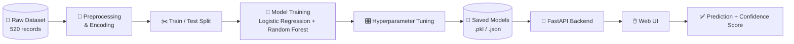

<div align="center">

# 🩺 Diabetes Prediction System

### *Machine learning risk assessment, from raw symptoms to prediction in real time.*


</div>

<br/>

> ⚠️ **This is a screening/educational tool, not a diagnostic one.** It does not replace a doctor. See the [Disclaimer](#️-disclaimer) before using or citing it.

---

## 📖 Table of Contents

- [Overview](#-overview)
- [Features](#-features)
- [How It Works](#-how-it-works)
- [Tech Stack](#️-tech-stack)
- [Quick Start](#-quick-start)
- [Using the App](#-using-the-app)
- [Deployment](#️-deployment)
- [Dataset](#-dataset)
- [Project Structure](#-project-structure)
- [Model Performance](#-model-performance)
- [Troubleshooting](#-troubleshooting)
- [Disclaimer](#️-disclaimer)
- [Contributing](#-contributing)
- [License & Contact](#-license--contact)

---

## 🎯 Overview

The Diabetes Prediction System takes a patient's age, gender, and a set of common diabetes-related symptoms (Polyuria, Polydipsia, sudden weight loss, and more) and returns a real-time risk assessment — Positive or Negative — with a confidence score and full probability breakdown.

Under the hood, a **Random Forest classifier** (trained alongside a Logistic Regression baseline, with hyperparameter tuning) does the prediction. A **FastAPI** backend serves both the model and a lightweight HTML/CSS/JS interface, so the whole thing runs as a single, self-contained web app.

## ✨ Features

| | |
|---|---|
| 🖥️ **Interactive UI** | Clean HTML/CSS/JS frontend served directly by FastAPI |
| 🧠 **ML-Powered** | Random Forest classifier with tuned hyperparameters |
| ⚡ **Real-Time Predictions** | Submit symptoms, get an instant risk assessment |
| 📊 **Transparent Metrics** | Accuracy and ROC-AUC surfaced in the app's Model Info tab |
| 📈 **Visual Analytics** | Confusion matrix, ROC curve, and feature importance plots generated at training time |
| ☁️ **Deploy-Ready** | Pre-configured for Vercel's Python serverless runtime |

## 🔬 How It Works



1. Symptoms and demographics go in through the web form
2. The FastAPI backend loads the trained Random Forest model, scaler, and encoders
3. Input is encoded and scaled to match the training pipeline exactly
4. The model returns a class prediction plus a probability breakdown
5. The result renders instantly in the UI — no page reload

## 🛠️ Tech Stack

<div align="center">

| Layer | Tools |
|---|---|
| **Frontend** | HTML · CSS · JavaScript |
| **Backend** | FastAPI |
| **Machine Learning** | scikit-learn |
| **Data Processing** | pandas · NumPy |
| **Visualization** | Matplotlib · Seaborn |
| **Model Persistence** | Joblib |
| **Deployment** | Vercel (Python serverless) |

</div>

## 🚀 Quick Start

**Prerequisites:** Python 3.8+ and pip

```bash
# 1. Install dependencies
pip install -r requirements.txt

# 2. Train the models
python train_model.py

# 3. Launch the app
python web_backend.py
```

Then open **`http://localhost:5000`** in your browser.

`train_model.py` handles the full pipeline — loading and preprocessing the dataset, training both models, tuning hyperparameters, generating the performance plots, and saving everything needed for inference:

```
random_forest_model.pkl   logistic_model.pkl        scaler.pkl
feature_encoders.pkl      target_encoder.pkl        feature_names.json
model_metadata.json       *.png (visualizations)
```

## 🔬 Using the App

1. Open the web application
2. Enter patient info — age, gender, and symptoms (Polyuria, Polydipsia, sudden weight loss, etc.)
3. Click **Predict Diabetes Risk**
4. Read the result: prediction, confidence score, and probability breakdown

## ☁️ Deployment

This project ships ready for **Vercel's Python serverless** runtime:

| Component | File |
|---|---|
| FastAPI entrypoint | `app.py` |
| Main app module | `web_backend.py` |
| Vercel config | `vercel.json` |
| Health check | `GET /health` |

> Seeing an entrypoint error on Vercel? Redeploy after confirming `app.py` and `vercel.json` are both present in the repo.

## 📊 Dataset

- **`diabetes_data_upload.csv`**
- 520 patient records
- 16 features — age, gender, and a range of diabetes-associated symptoms
- Binary target: Positive / Negative

## 📁 Project Structure

```
Diabetes/
│
├── web_backend.py                                  # FastAPI backend for the HTML UI
├── templates/index.html                             # Main HTML page
├── static/style.css                                 # Stylesheet
├── static/app.js                                    # Frontend JavaScript
├── train_model.py                                   # Model training script
├── copy_of_diabetes_disease_prediction_system.py     # Original notebook
├── diabetes_data_upload.csv                          # Dataset
├── requirements.txt                                  # Python dependencies
├── README.md
│
└── Generated after training/
    ├── random_forest_model.pkl
    ├── logistic_model.pkl
    ├── scaler.pkl
    ├── feature_encoders.pkl
    ├── target_encoder.pkl
    ├── feature_names.json
    ├── model_metadata.json
    └── *.png visualizations
```

## 📈 Model Performance

The Random Forest model is the primary classifier, benchmarked against a Logistic Regression baseline:

- High accuracy on held-out test data
- Strong ROC-AUC score
- Balanced precision and recall

Exact figures, the confusion matrix, ROC curve, and feature importance plots are all available in the app's **Model Info** tab after training.

## 🐛 Troubleshooting

| Problem | Fix |
|---|---|
| **Models not found** | Run `python train_model.py` first to generate the `.pkl`/`.json` files |
| **Import errors** | Run `pip install -r requirements.txt` to confirm all dependencies are present |
| **Port already in use** | Change the port passed to `app.run` in `web_backend.py` (e.g. `8502`) |

## ⚠️ Disclaimer

**This tool is for educational and screening purposes only.**

- It is **not** a substitute for professional medical diagnosis
- Always consult a qualified healthcare professional
- Do not make medical decisions based solely on this prediction

## 🤝 Contributing

Forks, improvements, and pull requests are welcome — open an issue first for larger changes so direction can be discussed before the work goes in.

## 📄 License & Contact

Licensed for **educational purposes**. For questions or issues, open an issue in the project repository.

<div align="center">
<br/>

*Built for learning how ML pipelines go from raw data to a real decision, end to end.*

</div>
